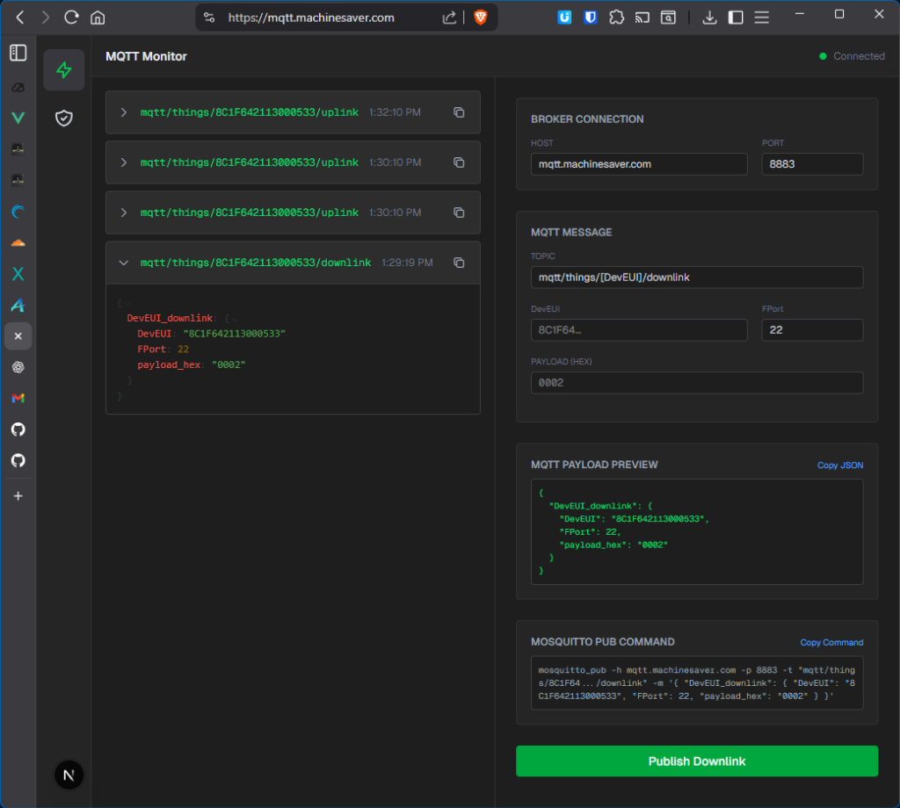

# AirVibe Waveform Manager

A self-hosted web dashboard for managing AirVibe vibration sensors over LoRaWAN. Monitor MQTT traffic in real-time, send downlink commands to configure sensors, collect and visualize waveform data, and manage TLS certificates for secure MQTT connections — all from a single browser interface.



## Features

- **Real-time MQTT monitoring** — subscribe to all broker topics and inspect messages as they arrive
- **Downlink command builder** — 20+ AirVibe command presets (sensor config, alarms, waveform control) with auto-discovered DevEUI selection
- **PKI certificate management** — generate CA, server, and client X.509 certificates compatible with Actility ThingPark
- **Waveform data collection** — assemble fragmented waveform packets, request missing segments, and visualize tri-axial vibration data
- **Auto-TLS** — Caddy provisions Let's Encrypt certificates automatically for your domain
- **One-command deploy** — `./build.sh` builds and starts the entire stack, stamping the git commit hash and timestamp into the UI footer for easy version identification

## Architecture

```
                  ┌─────────────────────────────────────┐
                  │              Internet                │
                  └──────────────┬──────────────────────┘
                                 │
              ┌──────────────────▼──────────────────────┐
              │  Caddy (ports 80/443)                    │
              │  Reverse proxy + auto-SSL                │
              │    /api/*, /socket.io/* → Backend:4000   │
              │    /*                   → Frontend:3000  │
              └────┬─────────────────────────┬──────────┘
                   │                         │
        ┌──────────▼──────────┐   ┌──────────▼──────────┐
        │  Backend (Express)   │   │  Frontend (Next.js)  │
        │  Socket.io server    │   │  React 19 + Tailwind │
        │  MQTT client         │   │  Socket.io client    │
        │  PKI (OpenSSL)       │   │  Chart.js waveforms  │
        └──────────┬───────────┘   └──────────────────────┘
                   │
        ┌──────────▼──────────┐
        │  Mosquitto (MQTT)    │
        │  Port 1883 (plain)   │
        │  Port 8883 (TLS)     │
        └──────────┬───────────┘
                   │
        ┌──────────▼──────────────────────────┐
        │  Actility ThingPark (LoRaWAN NWS)   │
        │  ↕ AirVibe vibration sensors         │
        └─────────────────────────────────────┘
```

**Data flow:**
1. AirVibe sensors transmit via LoRaWAN to Actility ThingPark
2. ThingPark forwards uplinks over MQTT to Mosquitto (`mqtt/things/{DevEUI}/uplink`)
3. Backend subscribes to all topics and relays messages to the frontend via Socket.io
4. Downlink commands flow in reverse: frontend → backend → Mosquitto → ThingPark → sensor

## Prerequisites

| Requirement | Local development | Production |
|:---|:---:|:---:|
| Docker + Docker Compose | Required | Required |
| Git | Required | Required |
| Node.js 20+ | Only without Docker | — |
| Domain name + DNS A record | — | Required |
| VPS with ports 80, 443, 1883, 8883 open | — | Required |
| Actility ThingPark account | For real devices | Required |

## Quick Start (Local Development)

```bash
git clone https://github.com/MachineSaver/mqtt-manager.git
cd mqtt-manager
cp .env.example .env
./build.sh
```

Open [http://localhost:3000](http://localhost:3000) in your browser.

The default `.env` uses `DOMAIN=localhost`, which is all you need for local testing. Caddy will serve over HTTP on port 80 in this mode.

### Running without Docker

```bash
# Terminal 1 — Backend
cd backend && npm install && npm run dev

# Terminal 2 — Frontend
cd frontend && npm install && npm run dev
```

Backend runs on `http://localhost:4000`, frontend on `http://localhost:3000`.

## Production Deployment

This guide walks through deploying on a VPS with your own domain name, connected to your Actility ThingPark instance.

### 1. Provision a VPS

Use any provider (Hetzner, DigitalOcean, Linode, AWS EC2, etc.) running Ubuntu 22.04+.

### 2. Configure DNS

Log into your domain registrar (Cloudflare, Namecheap, GoDaddy, etc.) and create an **A record**:

| Field | Value |
|:---|:---|
| Type | `A` |
| Name / Host | `mqtt` (for `mqtt.example.com`) or `@` (for root domain) |
| Value / Target | Your VPS public IP address |
| TTL | 3600 (or Automatic) |

Wait for DNS propagation before proceeding (usually a few minutes).

### 3. Set up the VPS

SSH into your server and run the automated setup script:

```bash
ssh root@your-vps-ip

apt-get update && apt-get install -y git
git clone https://github.com/MachineSaver/mqtt-manager.git
cd mqtt-manager

chmod +x scripts/setup_vps.sh
./scripts/setup_vps.sh
```

The script will:
- Install Docker if not present
- Prompt you for your domain name
- Generate the `.env` file
- Configure the UFW firewall (ports 22, 80, 443, 1883, 8883)
- Build and start all containers

Alternatively, set up manually:

```bash
cp .env.example .env
# Edit .env:
#   DOMAIN=mqtt.example.com
#   NEXT_PUBLIC_API_URL=https://mqtt.example.com
./build.sh
```

### 4. Verify

Open `https://your-domain` in a browser. Caddy automatically provisions a Let's Encrypt TLS certificate on first request (may take up to a minute).

### 5. Generate certificates for Actility

1. Open the web dashboard and go to the **Certificate Management** tab
2. Enter a **Client ID** (e.g., `actility-prod` — alphanumeric, hyphens, underscores, and dots only)
3. Click **Generate & Sign**
4. The system generates:
   - `ca.crt` — Root CA (created once, reused for all clients)
   - `server.crt` / `server.key` — Mosquitto TLS server identity (includes SAN for your domain)
   - `{client-id}.crt` / `{client-id}.key` — Client certificate pair
5. Click each filename to **download the certificate files** directly from the browser
6. After generating certificates, Mosquitto's watcher detects the new files and automatically restarts with TLS enabled. **Allow 30–60 seconds** for the broker to restart before testing the TLS connection

### 6. Configure Actility ThingPark

In your ThingPark account, create a **Generic MQTT Connector** with:

| ThingPark field | Value |
|:---|:---|
| **Hostname** | `mqtt.example.com` |
| **Port** | `8883` |
| **CA Certificate** | Upload `certs/ca.crt` |
| **Client Certificate** | Upload `certs/{client-id}.crt` |
| **Client Private Key** | Upload `certs/{client-id}.key` |
| **Uplink topic pattern** | `mqtt/things/{DevEUI}/uplink` |
| **Downlink topic pattern** | `mqtt/things/{DevEUI}/downlink` |

After uploading, **allow 1–2 minutes** for ThingPark to establish the TLS connection. The connector status may show "Connection closed" initially while it retries with the new certificates. Once established, uplink messages from your AirVibe sensors will appear in the MQTT Monitor tab.

> **Tip:** If the connector doesn't connect on the first attempt, verify port 8883 is reachable from the internet (`openssl s_client -connect mqtt.example.com:8883`) and check the Mosquitto logs (`docker compose logs mqtt-broker`) for TLS errors.

### 7. Verify the MQTT connection

Once ThingPark is configured, trigger an uplink from an AirVibe sensor (or wait for periodic transmission). You should see a new message card appear in the MQTT Monitor with the device's DevEUI, topic, and JSON payload.

## Usage

### MQTT Monitor

The **MQTT Monitor** tab displays all messages received by the broker in real-time (last 500 messages). Each message card shows the topic, timestamp, and a collapsible JSON payload viewer.

### Downlink Command Builder

Select a DevEUI from the auto-discovered dropdown (populated from incoming uplinks) or enter one manually. Choose from preset commands organized by category:

| Category | fPort | Examples |
|:---|:---:|:---|
| TWF Info Requests | 22 | Request current config, trigger new waveform collection |
| Alarm Configuration | 31 | Set temperature/acceleration alarm thresholds |
| Sensor Configuration | 30 | Overall mode intervals, TWF-only mode, dual mode |
| Waveform Control | 20–21 | ACK packets, request missing segments |

### Waveform Data

When AirVibe sensors transmit waveform data, the system automatically:
1. Receives metadata packets (TWIU — segment count, sample rate, axis config)
2. Collects data segments (TWD) and tracks progress with a visual segment map
3. Requests missing segments via downlink
4. Assembles the complete waveform and renders a tri-axial chart

## Configuration Reference

All configuration is through environment variables in `.env`. See `.env.example` for the full template.

| Variable | Required | Default | Description |
|:---|:---:|:---|:---|
| `DOMAIN` | Yes | `localhost` | FQDN for Caddy auto-SSL and certificate CN |
| `NEXT_PUBLIC_API_URL` | Production | `http://localhost:4000` | Public URL the frontend uses to reach the backend |
| `MQTT_BROKER_URL` | No | `mqtt://mqtt-broker:1883` | MQTT broker URL (used by backend container) |
| `MQTT_USER` | No | — | Mosquitto username (requires broker config) |
| `MQTT_PASS` | No | — | Mosquitto password |
| `POSTGRES_USER` | No | `postgres` | PostgreSQL username (waveform features) |
| `POSTGRES_PASSWORD` | No | `postgres` | PostgreSQL password |
| `POSTGRES_HOST` | No | `postgres` | PostgreSQL hostname |
| `POSTGRES_DB` | No | `airvibe` | PostgreSQL database name |
| `POSTGRES_PORT` | No | `5432` | PostgreSQL port |

## Project Structure

```
├── Caddyfile                  # Reverse proxy configuration
├── docker-compose.yml         # Service orchestration (4 services)
├── .env.example               # Environment variable template
├── backend/
│   ├── Dockerfile
│   └── src/
│       ├── index.js           # Express server, Socket.io, REST API
│       ├── mqttClient.js      # MQTT broker connection and message relay
│       ├── pki.js             # X.509 certificate generation (OpenSSL)
│       ├── db.js              # PostgreSQL connection pool
│       ├── db/schema.sql      # Database schema (waveforms, segments)
│       └── services/
│           └── WaveformManager.js  # Waveform packet processing and assembly
├── frontend/
│   ├── Dockerfile
│   └── src/
│       ├── app/
│       │   ├── page.tsx           # Main UI (MQTT monitor + cert management tabs)
│       │   ├── SocketContext.tsx   # Socket.io React context provider
│       │   ├── layout.tsx         # Root layout with Geist fonts
│       │   └── globals.css        # Tailwind base styles
│       └── components/
│           ├── MQTTMessageCard.tsx # Collapsible message display
│           ├── WaveformsView.tsx   # Waveform list and detail viewer
│           ├── WaveformChart.tsx   # Chart.js tri-axial line chart
│           └── SegmentMap.tsx      # Visual segment completion grid
├── mosquitto/
│   ├── config/mosquitto.conf  # Broker configuration (ports 1883 + 8883 TLS)
│   └── watcher.sh             # Auto-restart broker on cert changes
├── certs/                     # Generated certificates (shared volume)
├── scripts/
│   ├── setup_vps.sh           # Automated VPS provisioning
│   └── simulate_waveform.js   # Test tool for waveform protocol
└── .github/workflows/ci.yml   # GitHub Actions — Docker build verification
```

## Troubleshooting

**Caddy won't provision SSL certificate**
- Verify your DNS A record points to the correct IP and has propagated (`dig mqtt.example.com`)
- Ensure ports 80 and 443 are open and not blocked by your VPS firewall
- Check Caddy logs: `docker compose logs caddy`

**Mosquitto fails to start on port 8883**
- TLS requires `ca.crt`, `server.crt`, and `server.key` in the `certs/` directory
- Generate certificates via the web dashboard first, then restart: `docker compose restart mqtt-broker`
- Check broker logs: `docker compose logs mqtt-broker`

**Frontend can't connect to Socket.io**
- For production, ensure `NEXT_PUBLIC_API_URL` is set to your HTTPS domain in `.env`
- This variable is baked into the frontend at build time — rebuild after changing: `./build.sh`

**No messages appearing in MQTT Monitor**
- Verify the broker is running: `docker compose logs mqtt-broker`
- Test locally with an MQTT client: `mosquitto_pub -h localhost -p 1883 -t test -m "hello"`
- For Actility, check the ThingPark connector status and certificate validity

**Actility connector shows "Connection closed" or "Timed out"**
- This is normal immediately after uploading certificates — ThingPark retries every 30–60 seconds. Wait a few minutes.
- Verify Mosquitto's TLS listener is running: `docker compose logs mqtt-broker | grep 8883`
- Test the TLS connection from your VPS: `openssl s_client -connect mqtt.example.com:8883 -CAfile ./certs/ca.crt -cert ./certs/{client-id}.crt -key ./certs/{client-id}.key`
- If you see `certificate verify failed` in Mosquitto logs, ensure the `ca.crt` uploaded to ThingPark matches the one that signed your server certificate (regenerate all certs if unsure: `sudo rm -rf ./certs && docker compose down && ./build.sh`)
- If you see `peer did not return a certificate`, ThingPark is not sending the client cert — double-check the client certificate and key uploads in the connector settings

**Waveform assembly not working**
- Waveform features require PostgreSQL. Ensure a `postgres` service is available and `POSTGRES_*` env vars are configured
- Check backend logs for DB connection errors: `docker compose logs backend`

## CI/CD

GitHub Actions (`.github/workflows/ci.yml`) runs `docker compose build` on every push and pull request to `main`, verifying that all service images build successfully.
