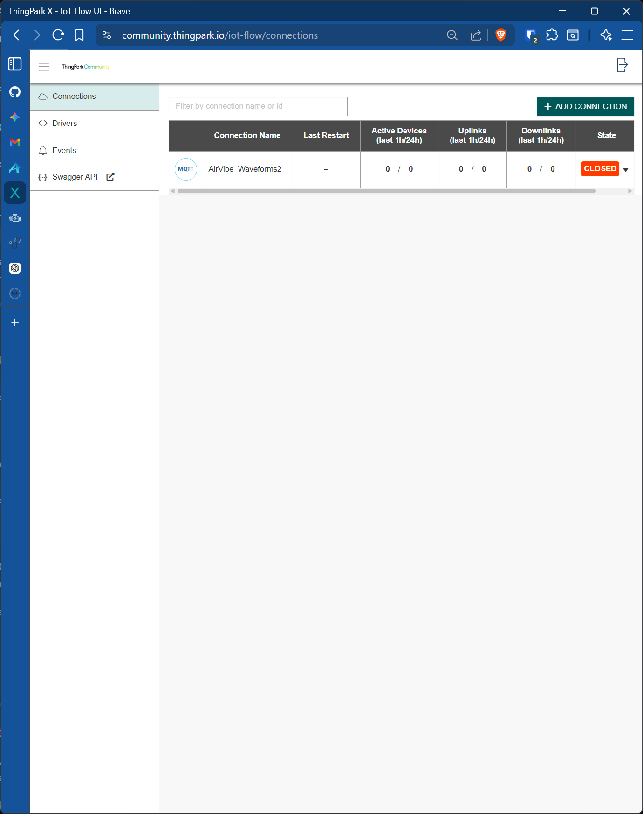
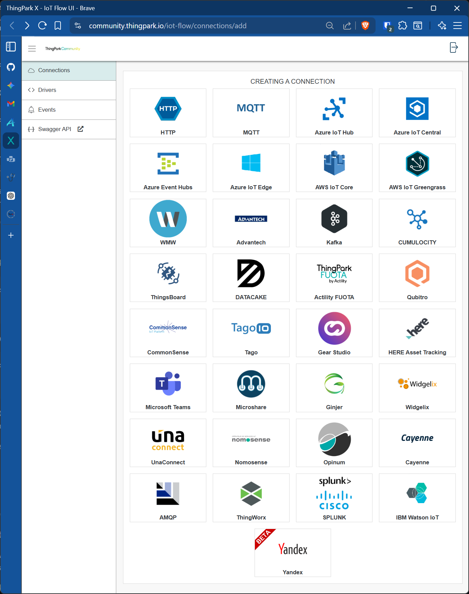
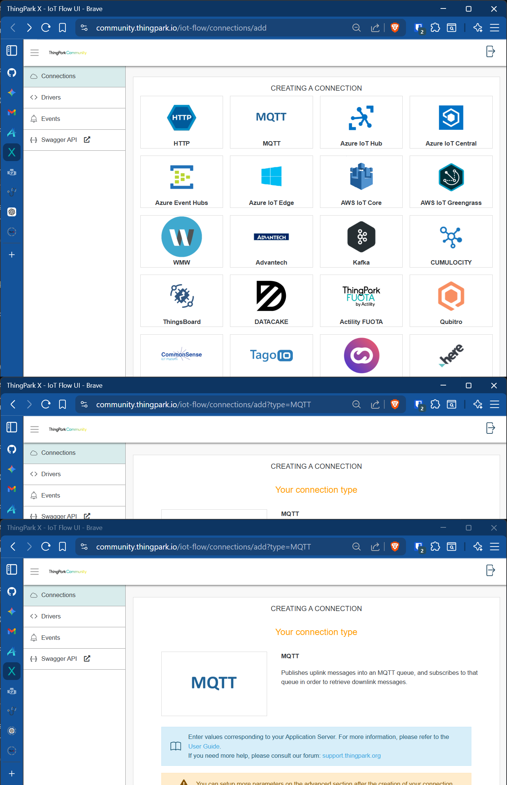

# AirVibe Manager

AirVibe Manager is a Docker-based platform for monitoring, managing, and firmware-updating AirVibe vibration sensors over LoRaWAN. It runs in two modes: **on-premise** (self-hosted ChirpStack LoRaWAN network server, no cloud dependency) and **cloud** (Actility ThingPark network server, AirVibe management layer only).

---

## Choosing Your Deployment Mode

Read this section before anything else — picking the wrong mode means redoing your setup.

| | On-Premise (ChirpStack) | Cloud (ThingPark) |
|---|---|---|
| LoRaWAN network server | ChirpStack v4, runs in Docker on your hardware | Actility ThingPark (SaaS, cloud-hosted) |
| Internet required at runtime | No — fully air-gapped capable | Yes — sensor data transits Actility's cloud |
| Data sovereignty | All sensor data stays on your hardware | Sensor payload data transits Actility infrastructure |
| Cost | Free and open-source (hardware + hosting costs only) | Actility ThingPark subscription required |
| Gateway setup | Point packet forwarder at your LAN IP (UDP 1700) | Point packet forwarder at Actility's network server |
| Hardware required | Linux host (x86-64 or ARM64, ≥ 2 GB RAM) | Any host with Docker (≥ 512 MB RAM) |
| Initial setup complexity | Higher — ChirpStack UI, device provisioning, gateway config | Lower — ThingPark handles LoRaWAN provisioning |
| FUOTA Class C auto-switch | Automatic via ChirpStack API (optional API key) | Automatic via ThingPark DX Core API (optional credentials) |
| LoRaWAN stack control | Full — ADR, channels, join server all configurable | Managed by Actility |

**Choose on-premise if** your facility has no reliable internet, you have data-residency or compliance requirements that prohibit cloud transit, or you are building a new deployment from scratch and want full control of the LoRaWAN stack.

**Choose ThingPark if** you are already a ThingPark subscriber with devices provisioned on that network, you want Actility to manage LoRaWAN infrastructure, or your deployment has limited on-site IT capability for server management.

**Not sure?** The on-premise mode is the default — it requires more initial setup but gives you complete independence from any external service.

---

## Features

| Feature | Description |
|---|---|
| **MQTT Monitor** | Real-time MQTT message feed with DevEUI/direction filtering, embedded downlink builder (collapsible), and scroll anchoring |
| **Waveform Manager** | Captures, assembles, and exports AirVibe waveform captures (JSON + CSV) |
| **FUOTA Manager** | Firmware-over-the-air updates with block transmission, verify/retry loop, and missed-block map. Class A↔C auto-switching via ChirpStack API (on-premise) or ThingPark DX Core API (cloud, optional credentials required). |
| **Historian** | Server-side message search with DevEUI, direction, and date-range filters; paginated results |
| **Dev Tools** | Three sub-tabs: Sensor Simulator (demo mode), Waveform Tracker (hex packet decoder/assembler), and Certificate Manager (X.509 cert generation for MQTT TLS) |
| **ChirpStack UI** | *(On-premise only)* Full LoRaWAN network management: gateways, devices, applications, live frame log |

---

## REST API

AirVibe exposes a full REST API documented with OpenAPI 3.1.

| Path | Description |
|---|---|
| `GET /api/docs/` | Interactive Swagger UI — browse and test all 28 endpoints in the browser |
| `GET /api/openapi.json` | Raw OpenAPI 3.1 spec (live, always current) |

A static copy of the spec is kept at [`openapi.json`](openapi.json) in the repository root and updated on every spec change. It can be consumed directly by code generators:

```bash
# Generate a Python client from the static spec (requires openapi-generator-cli)
openapi-generator-cli generate -i openapi.json -g python -o ./airvibe-client
```

Authentication is controlled by the `API_KEYS_ENABLED` environment variable. When enabled, all endpoints except `/`, `/api/health`, `/api/openapi.json`, and `/api/docs/` require an `Authorization: Bearer <key>` header. Create your first key by setting `BOOTSTRAP_API_KEY` in `.env`, then manage additional keys via `POST /api/keys`.

---

## Architecture

### On-Premise Architecture

```
AirVibe sensors (LoRa RF)
    │
LoRaWAN Gateways (1..N)
    │  UDP port 1700
    ▼
┌──────────────────── One Linux box ────────────────────────┐
│  chirpstack-gateway-bridge  (UDP:1700 → MQTT internal)    │
│  chirpstack LNS + AS        (port 8080)                   │
│  mosquitto MQTT broker      (port 1883 / 8883)            │
│  redis                      (internal)                    │
│  postgres                   (internal)                    │
│  AirVibe backend            (port 4000)                   │
│  AirVibe frontend + Caddy   (port 443)                    │
└───────────────────────────────────────────────────────────┘
    ▲
Browser / Tablet (same LAN or VPN)
```

**On-premise data flow (uplink):**
1. AirVibe sensor → Gateway → Gateway Bridge (UDP:1700) → Mosquitto
2. ChirpStack subscribes to gateway topics, handles MAC layer, decrypts payload
3. ChirpStack publishes decoded uplink to Mosquitto: `application/{id}/device/{devEUI}/event/up`
4. AirVibe backend adapter normalizes ChirpStack message → internal canonical format
5. WaveformManager + FUOTAManager process the canonical message
6. Frontend receives events over Socket.io and renders them in all management tabs

**On-premise data flow (downlink):**
Frontend → Socket.io → Backend → ChirpStack adapter (hex → base64, internal topic → ChirpStack command topic) → Mosquitto → ChirpStack → Gateway → AirVibe device

---

### Cloud / ThingPark Architecture

```
AirVibe sensors (LoRa RF)
    │
LoRaWAN Gateways (1..N)
    │  UDP — points at Actility network server endpoints
    ▼
┌──────────────────── Actility ThingPark Cloud ──────────────────────┐
│  Actility LoRaWAN Network Server + Application Server              │
│  Decrypts payload, publishes DevEUI_uplink JSON via MQTT connector │
└──────────────────────────┬─────────────────────────────────────────┘
                           │  MQTTS port 8883 (mTLS — ThingPark connects TO your broker)
                           ▼
┌──── Your AirVibe host ─────────────────────────────────────────────┐
│  mosquitto MQTT broker  (port 8883 TLS inbound from ThingPark,     │
│                          port 1883 plain for internal backend)     │
│  postgres                                                          │
│  AirVibe backend        (subscribes to local Mosquitto on 1883)    │
│  AirVibe frontend + Caddy  (port 443)                              │
└────────────────────────────────────────────────────────────────────┘
    ▲
Browser / Tablet
```

**ThingPark data flow (uplink):**
1. Sensor → Gateway → Actility ThingPark (decrypts, decodes)
2. ThingPark MQTT connector (configured in ThingPark X IoT Flow) publishes `DevEUI_uplink` JSON to your Mosquitto broker on port 8883 using mutual TLS certificates generated by AirVibe's Certificate Manager
3. AirVibe backend subscribes to Mosquitto on the internal Docker network (port 1883); ThingPark adapter is a passthrough — message is already in canonical format
4. WaveformManager + FUOTAManager process identically to on-premise mode

**ThingPark data flow (downlink):**
Frontend → Socket.io → Backend → ThingPark adapter (passthrough, `DevEUI_downlink` JSON) → Mosquitto → ThingPark MQTT connector → ThingPark → Gateway → AirVibe device

---

## Requirements

### On-Premise

- Docker + Docker Compose v2 (`docker compose`, not `docker-compose`)
- Linux host (x86-64 or ARM64, ≥ 2 GB RAM, ≥ 8 GB storage)
- LoRaWAN gateway with Semtech UDP Packet Forwarder (RAK, Dragino, Kerlink, MultiTech, Tektelic, etc.)
- AirVibe sensors provisioned with DevEUI + AppKey
- No internet required at runtime

### ThingPark / Cloud

- Docker + Docker Compose v2
- Any host with Docker support (≥ 512 MB RAM, ≥ 8 GB storage)
- Active Actility ThingPark subscription with gateways and devices provisioned
- ThingPark MQTT bridge URL and credentials
- Public domain name for HTTPS (Caddy handles certificate issuance via Let's Encrypt) — or access directly via host IP with a self-signed cert

---

## Quick Start

### Quick Start A — On-premise, full stack (default)

Everything on one box. Zero edits required for local testing.

```bash
git clone <repo-url> && cd AirVibe_Waveform_Manager
cp .env.example .env
# Defaults work as-is — no edits needed for localhost
./build.sh
```

Services started: all 8. Access: `https://localhost` (browser warning until Caddy root CA is trusted — see [TLS Setup](#tls-setup)).

Then follow [ChirpStack Initial Setup](#chirpstack-initial-setup) to register your gateway and devices.

---

### Quick Start B — On-premise, connect to existing ChirpStack

For plants that already run ChirpStack. Change four values in `.env`:

```bash
COMPOSE_PROFILES=           # empty — don't start bundled ChirpStack
MQTT_BROKER_URL=mqtt://192.168.1.100:1883
CHIRPSTACK_API_URL=http://192.168.1.100:8080
DOMAIN=localhost            # or your AirVibe host's LAN hostname
```

```bash
./build.sh
```

Services started: 4 (postgres, backend, frontend, caddy).

---

### Quick Start C — Cloud / ThingPark

Change these values in `.env`:

```bash
NETWORK_SERVER=thingpark
COMPOSE_PROFILES=           # empty — ChirpStack infrastructure not needed
DOMAIN=airvibe.yourcompany.com
NEXT_PUBLIC_API_URL=https://airvibe.yourcompany.com
```

Everything else stays at its default — `MQTT_BROKER_URL` defaults to `mqtt://mqtt-broker:1883`, pointing at the bundled Mosquitto broker that ThingPark will connect to.

```bash
./build.sh
```

Services started: 5 (postgres, backend, frontend, caddy, mosquitto).

TLS: Caddy requests a Let's Encrypt certificate automatically for `DOMAIN`. Ports 80 and 443 must be reachable from the internet for the ACME HTTP-01 challenge. Port 8883 must also be reachable for the ThingPark MQTT connector.

Then follow [ThingPark Initial Setup](#thingpark-initial-setup) to generate certificates and configure the ThingPark MQTT connector.

---

## Build Script (`build.sh`)

Always use `./build.sh` instead of calling `docker compose up -d --build` directly. The script stamps two values into the Next.js frontend bundle at build time:

```bash
./build.sh
```

What it does:
1. Reads the current git commit hash (`git rev-parse --short HEAD`)
2. Captures the UTC timestamp at the moment the build runs (`date -u`)
3. Exports both as `NEXT_PUBLIC_BUILD_HASH` and `NEXT_PUBLIC_BUILD_DATE`
4. Calls `docker compose up -d --build`

These values are baked into the frontend bundle and displayed in the footer of the UI:

```
build a1b2c3d • 2026-02-23T19:30:00Z
```

This makes it easy to confirm which version and build is running during troubleshooting without needing SSH access to the server.

**Important:** If you run `docker compose up -d --build` directly (without `./build.sh`), the footer will show `build unknown • unknown`. This applies to all full-stack rebuilds including initial deployment, mode switches, and updates after `git pull`.

Backend-only rebuilds (e.g. `docker compose up -d --build backend`) do not require `./build.sh` since the build info is only baked into the frontend.

---

## Deployment Profiles & Network Architecture

### What profile do I need?

| | Full profile | App-only / ThingPark profile |
|---|---|---|
| **`COMPOSE_PROFILES`** | `full` | _(empty)_ |
| **`NETWORK_SERVER`** | `chirpstack` (default) | `chirpstack` or `thingpark` |
| **Services started** | 9 (8 persistent + db-init sidecar) | 5 (postgres, backend, frontend, caddy, mosquitto) |
| **MQTT broker** | Bundled Mosquitto | Bundled Mosquitto (ThingPark connects to it; ChirpStack app-only connects to an external broker) |
| **Use when** | Greenfield setup, testing, local dev | ThingPark cloud mode, or plant with existing ChirpStack |

### LoRaWAN in one paragraph

AirVibe sensors transmit over LoRa radio to **LoRaWAN gateways** — antenna hardware that simply forwards raw radio frames over UDP to a **network server**. The network server (ChirpStack or ThingPark) handles the MAC layer: device authentication, frame counting, deduplication, payload decryption, and delivery to the application layer. AirVibe is the application layer. Gateways are "dumb" forwarders — one network server instance handles as many gateways as needed. In on-premise mode, the Linux box is where ChirpStack and AirVibe both run; gateways just need network reachability to UDP port 1700. In ThingPark mode, the network server is in Actility's cloud; your Linux box runs only the AirVibe application layer.

### Network access requirements

| Source | Destination | Protocol | Port | Required by |
|---|---|---|---|---|
| LoRaWAN gateways | Linux box | UDP | 1700 | On-premise full only |
| Browser / tablet | Linux box (Caddy) | TCP | 443 | Always |
| AirVibe backend | Plant ChirpStack box | TCP | 1883, 8080 | On-premise app-only |
| ThingPark cloud | Linux box (Mosquitto) | TCP | 8883 | ThingPark mode |
| Internet (ACME) | Linux box | TCP | 80, 443 | ThingPark mode (Let's Encrypt) |

### Hardware sizing

| Deployment | CPU | RAM | Storage |
|---|---|---|---|
| Full stack (ChirpStack + AirVibe) | ≥ 2 cores | ≥ 2 GB | ≥ 8 GB |
| App-only / ThingPark (AirVibe only) | ≥ 1 core | ≥ 512 MB | ≥ 8 GB |

Storage grows as waveform captures accumulate. Plan accordingly for long-running deployments.

---

## ChirpStack Initial Setup

> **On-premise mode only.** ThingPark users skip this section — see [ThingPark Initial Setup](#thingpark-initial-setup).

Open `http://localhost:8080` (or `http://<host-ip>:8080` from another machine on the LAN).

### 1. Change the admin password
Account → Change Password

### 2. Create a Device Profile
Tenants → your tenant → Device Profiles → Add Device Profile

| Setting | Value |
|---|---|
| Name | e.g. `AirVibe-EU868` |
| Region | EU868 (or US915 to match your hardware) |
| MAC version | LoRaWAN 1.0.3 |
| Regional parameters | RevA |
| ADR algorithm | default |
| Supports OTAA | ✅ enabled |

### 3. Create an Application
Applications → Add Application (name it anything — e.g. "AirVibe Production")

Note the **Application ID** from the URL — you'll need it for `CHIRPSTACK_APPLICATION_ID` in `.env`.

### 4. Add your gateway
Network → Gateways → Add Gateway

Enter your gateway's EUI (usually printed on the hardware or in its web UI).

**On the gateway hardware**, set the packet forwarder server to:
```
Server address: <this-host-LAN-IP>
Port up:   1700
Port down: 1700
```

The gateway should appear as "Online" within ~30 seconds.

### 5. Register your AirVibe devices
Applications → your application → Add Device

| Field | Value |
|---|---|
| Name | Descriptive name (e.g. "Pump House - Sensor A") |
| Device EUI | 16-digit hex EUI from the device label |
| Device Profile | The profile created in step 2 |

After creating the device, go to **Keys (OTAA)** and enter the **Application Key** (AppKey). Power-cycle the AirVibe sensor to trigger a join request — it should appear as "Active" in the device list.

---

## ThingPark Initial Setup

> **Cloud / ThingPark mode only.** On-premise users skip this section — see [ChirpStack Initial Setup](#chirpstack-initial-setup).

In ThingPark mode AirVibe runs its own Mosquitto MQTT broker. ThingPark connects **to your broker** using a ThingPark X IoT Flow MQTT connector secured with mutual TLS certificates generated by AirVibe's Certificate Manager. Your backend then subscribes to the same broker internally.

### 1. Configure `.env` and start the stack

```bash
NETWORK_SERVER=thingpark
COMPOSE_PROFILES=
DOMAIN=airvibe.yourcompany.com       # your public domain
NEXT_PUBLIC_API_URL=https://airvibe.yourcompany.com
```

`MQTT_BROKER_URL`, `MQTT_USER`, and `MQTT_PASS` do **not** need to be changed — the backend connects to the bundled Mosquitto on the internal Docker network automatically.

```bash
./build.sh
```

### 2. Verify device provisioning
Confirm your AirVibe DevEUIs and AppKeys are registered in the ThingPark portal with an active device profile before proceeding.

### 3. Generate MQTT TLS certificates

Open the AirVibe UI at `https://airvibe.yourcompany.com`, go to the **Dev Tools** tab, and click **Certificates**. Click **Generate & Sign**. Once generated, download:

- **CA Certificate** (`ca.crt`) — the certificate authority that signed the server cert
- **Client Certificate** (`client.crt`) — ThingPark will present this to authenticate
- **Client Private Key** (`client.key`) — paired with the client certificate

These three files are uploaded to ThingPark in the next step.

### 4. Create a ThingPark MQTT Connector

Open **ThingPark X IoT Flow** (`community.thingpark.io/iot-flow`) and follow these steps:

**Step 0 — Open the Connections tab**

Click **Connections** in the left sidebar.



**Step 1 — Add a new connection**

Click the **+ ADD CONNECTION** button (top right).

**Step 2 — Select ThingPark X IoT Flow**

When prompted to choose the application type, select **ThingPark X IoT Flow** (not HTTPS).
*(No screenshot — this is the application-type selector before the connection-type page.)*

**Step 3 — Select MQTT as the connection type**

On the "Creating a Connection" screen, click **MQTT**.



**Step 4 — Fill in the connector details**



| Field | Value |
|---|---|
| Connection Name | Any name (e.g. `AirVibe_Production`) |
| Hostname | Your domain (e.g. `air.machinesaver.com`) |
| Port | `8883` |
| Protocol | **SSL** |
| CA Certificate | Upload `ca.crt` from step 3 |
| Certificate | Upload `client.crt` from step 3 |
| Private Key | Upload `client.key` from step 3 |
| MQTT Username | *(optional — leave blank)* |
| MQTT Password | *(optional — leave blank)* |

Click **Create**.

**Step 5 — Wait for the connector to show as Connected**

The connector status column will change from `CLOSED` to `CONNECTED` within a few seconds once Mosquitto accepts the mTLS handshake.

**Step 6 — Add the connector to each device**

In the ThingPark device list, open each AirVibe device and assign it to this connector. Uplinks will begin appearing in the AirVibe MQTT Monitor tab immediately.

### 5. Domain and TLS
Caddy handles Let's Encrypt certificate issuance automatically on first startup — no manual certificate management required. Ports 80, 443, and 8883 must all be reachable from the internet.

---

## Enabling FUOTA Class C Auto-Switch

### On-Premise (ChirpStack)

**Generate an API key in ChirpStack:**
API Keys → Create API Key → copy the token

**Add to `.env`:**
```bash
CHIRPSTACK_API_KEY=your-api-key-here
CHIRPSTACK_APPLICATION_ID=1   # from the ChirpStack application URL
```

**Restart the backend:**
```bash
docker compose restart backend
```

The FUOTA Manager tab will show a green "ChirpStack Class C auto-switch enabled" banner.

### Cloud (ThingPark)

Automatic Class C switching is available via the ThingPark DX Core API. Add these to `.env` and restart the backend:

```bash
THINGPARK_BASE_URL=https://community.thingpark.io   # default is correct for Community server
THINGPARK_CLIENT_ID=your-dx-client-id
THINGPARK_CLIENT_SECRET=your-dx-client-secret
```

Generate DX Core API credentials in the ThingPark portal → DX Admin → Applications → Add.

```bash
docker compose restart backend
```

The FUOTA Manager tab will show a green "ThingPark Class C auto-switch enabled" banner.

**Without credentials:** The FUOTA state machine still works — block transmission, verify/retry loop, and missed-block map all function normally. Only the Class A↔C profile switch is skipped. You must manually assign a Class C device profile in the ThingPark portal before starting each FUOTA session and restore the original profile afterward.

---

## TLS Setup

### On-Premise — `tls internal` (LAN self-signed)

Caddy is its own certificate authority and issues a certificate for `DOMAIN` without requiring any public DNS or internet access.

**To eliminate the browser warning (one-time per machine):**

```bash
docker exec mqtt-manager-caddy cat /data/caddy/pki/authorities/local/root.crt > caddy-root-ca.crt
```

Import `caddy-root-ca.crt` into your OS trust store:

| OS | Steps |
|---|---|
| **macOS** | Double-click → Keychain Access → set trust to "Always Trust" |
| **Windows** | Double-click → Install Certificate → Local Machine → Trusted Root Certification Authorities |
| **Ubuntu/Debian** | `sudo cp caddy-root-ca.crt /usr/local/share/ca-certificates/ && sudo update-ca-certificates` |
| **Firefox** | Settings → Privacy & Security → Certificates → View Certificates → Authorities → Import |

### Cloud — Automatic ACME / Let's Encrypt

When `DOMAIN` is set to a public domain and `NETWORK_SERVER=thingpark`, Caddy's entrypoint detects it is not localhost and omits the `tls internal` directive. Caddy automatically requests a certificate from Let's Encrypt — no manual configuration required.

Requirements:
- Port 80 and 443 must be reachable from the internet (for the ACME HTTP-01 challenge)
- `DOMAIN` DNS A record must point at the AirVibe host before first startup
- No browser warning — certificate is publicly trusted

---

## Switching Modes

To switch between on-premise and ThingPark (or vice versa) on an existing deployment:

```bash
# 1. Stop the stack
docker compose down

# 2. Edit .env — change NETWORK_SERVER, COMPOSE_PROFILES, DOMAIN,
#    MQTT_BROKER_URL, NEXT_PUBLIC_API_URL as needed

# 3. Rebuild and restart
#    NEXT_PUBLIC_API_URL is baked into the frontend bundle at build time —
#    a rebuild is always required when it changes.
./build.sh
```

**Data:** Your PostgreSQL `airvibe` database (waveform history, device registry, FUOTA sessions) is preserved across mode switches — it lives on the `postgres_data` Docker volume. The `chirpstack` database (device provisioning, gateway config) is only relevant in on-premise mode.

**Important:** `NEXT_PUBLIC_API_URL` is compiled into the Next.js bundle at build time. Restarting the frontend container after changing this variable has no effect. Always use `./build.sh` (not `docker compose up -d --build` directly) after changing any `NEXT_PUBLIC_*` variable or after a `git pull` — this ensures the build hash and timestamp in the UI footer are correct.

---

## Remote Access Options

For access from outside the local network without exposing ports to the internet:

| Option | Effort | Notes |
|---|---|---|
| **Tailscale** | Very low | Install on the host. Access via Tailscale IP or MagicDNS. No firewall changes needed. **Recommended.** |
| **WireGuard** | Medium | Full control. Can be added as an additional Docker service. |
| **Cloudflare Tunnel** | Low | Routes through Cloudflare's edge. Free tier available. |

---

## Gateway Compatibility

The Gateway Bridge supports all major commercial gateways without firmware changes:

| Protocol | Port | Gateways |
|---|---|---|
| Semtech UDP Packet Forwarder | 1700/UDP | RAK, Dragino, Kerlink, Tektelic, MultiTech, Laird, most others |
| Basics Station (LNS) | configurable | RAK (newer FW), Semtech Corecell, others with BS support |

To use Basics Station instead of UDP, update `chirpstack/chirpstack-gateway-bridge.toml` and change `[backend]` type to `basic_station`.

---

## Development

### Local development (without Docker)

Requirements: Node.js 20+, PostgreSQL, Mosquitto (or ThingPark MQTT access), and a running ChirpStack instance (on-premise mode).

```bash
# Terminal 1 — Backend
cd backend && npm install && npm run dev    # nodemon auto-reload on port 4000

# Terminal 2 — Frontend
cd frontend && npm install && npm run dev   # Next.js dev server on port 3000
```

### Lint and build

```bash
cd frontend
npm run lint    # ESLint 9 flat config, next/core-web-vitals
npm run build   # Production Next.js build
```

### Running backend unit tests

```bash
cd backend && npm test    # Jest — adapter and waveform tests
```

### Running only ChirpStack locally (for development)

```bash
COMPOSE_PROFILES=full docker compose up -d chirpstack-gateway-bridge chirpstack redis mqtt-broker postgres
```

Then run the backend and frontend with `npm run dev` as above.

---

## Environment Variables

| Variable | Default | Mode | Description |
|---|---|---|---|
| `NETWORK_SERVER` | `chirpstack` | Both | `chirpstack` or `thingpark` — selects MQTT adapter and Caddyfile TLS mode |
| `COMPOSE_PROFILES` | _(none)_ | Both | Set `full` to start bundled ChirpStack + Mosquitto + Redis |
| `DOMAIN` | `localhost` | Both | Hostname for Caddy TLS and CORS |
| `NEXT_PUBLIC_API_URL` | `https://localhost` | Both | Browser-accessible backend URL — baked into frontend at build time |
| `MQTT_BROKER_URL` | `mqtt://mqtt-broker:1883` | Both | Override in app-only or ThingPark mode |
| `MQTT_USER` | _(none)_ | Both | Optional MQTT username |
| `MQTT_PASS` | _(none)_ | Both | Optional MQTT password |
| `POSTGRES_USER` | `postgres` | Both | PostgreSQL username |
| `POSTGRES_PASSWORD` | `postgres` | Both | Change in production |
| `POSTGRES_DB` | `airvibe` | Both | AirVibe application database |
| `CHIRPSTACK_API_URL` | `http://chirpstack:8080` | On-premise | Override in app-only mode |
| `CHIRPSTACK_API_KEY` | _(none)_ | On-premise | Enables Class C auto-switch for FUOTA |
| `CHIRPSTACK_APPLICATION_ID` | `1` | On-premise | App ID from ChirpStack UI |
| `THINGPARK_BASE_URL` | `https://community.thingpark.io` | Cloud | ThingPark DX Core API base URL |
| `THINGPARK_CLIENT_ID` | _(none)_ | Cloud | ThingPark DX Core client ID for Class C auto-switch |
| `THINGPARK_CLIENT_SECRET` | _(none)_ | Cloud | ThingPark DX Core client secret for Class C auto-switch |
| `MESSAGES_MAX_AGE_DAYS` | `90` | Both | Days before old message rows are purged (nightly cleanup job) |
| `WAVEFORMS_FAILED_TTL_DAYS` | `7` | Both | Days to retain failed/aborted waveform rows before purging (runs every 5 min) |
| `FUOTA_MQTT_WAIT_MS` | `300000` | Both | Milliseconds FUOTA block-send loop waits for MQTT reconnect before failing the session |
| `API_KEYS_ENABLED` | `false` | Both | Set to `true` to require `Authorization: Bearer <key>` on all API endpoints (except `/` and `/api/health`) |
| `BOOTSTRAP_API_KEY` | _(none)_ | Both | A known `airvibe_…` key inserted idempotently at startup — solves chicken-and-egg when enabling auth for the first time |

---

## Project Structure

```
├── caddy/
│   └── entrypoint.sh               # Generates Caddyfile at runtime from NETWORK_SERVER + DOMAIN
├── docker-compose.yml              # 8-service stack (profiles: full / app-only)
├── .env.example                    # Unified template — covers both deployment modes
├── openapi.json                        # Static OpenAPI 3.1 spec (generated — do not edit by hand)
├── scripts/
│   └── smoke-test.sh               # End-to-end profile smoke tests (full, app-only, ThingPark)
├── chirpstack/
│   ├── chirpstack.toml             # ChirpStack main config
│   ├── chirpstack-gateway-bridge.toml
│   ├── region_eu868.toml           # EU868 channel plan
│   └── region_us915_0.toml         # US915 sub-band 2 channel plan
├── backend/
│   ├── scripts/
│   │   └── export-openapi.js       # Regenerates openapi.json from src/openapi.js
│   ├── test/
│   │   ├── adapter.test.js         # Jest unit tests — ChirpStack + ThingPark adapters
│   │   └── waveform.test.js        # Jest unit tests — WaveformManager
│   └── src/
│       ├── index.js                # Express server, Socket.io, REST API
│       ├── mqttClient.js           # MQTT connection; selects adapter from NETWORK_SERVER
│       ├── pki.js                  # X.509 certificate generation
│       ├── db.js                   # PostgreSQL connection pool
│       ├── adapters/
│       │   ├── chirpstack.js       # ChirpStack ↔ internal format adapter
│       │   └── thingpark.js        # ThingPark passthrough adapter (identity)
│       ├── utils/
│       │   └── deinterleave.js     # Multi-axis waveform payload splitter
│       └── services/
│           ├── networkServerClient.js # Mode selector: routes Class C switching to ChirpStack or ThingPark client
│           ├── ChirpStackClient.js    # Class A↔C switching via ChirpStack REST API
│           ├── ThingParkClient.js     # Class A↔C switching via ThingPark DX Core API (OAuth2)
│           ├── WaveformManager.js     # Waveform packet processing and assembly
│           ├── FUOTAManager.js        # Firmware update state machine
│           ├── MessageTracker.js      # Message persistence and device registry
│           ├── DemoSimulator.js       # Dual-mode demo (ChirpStack or ThingPark format)
│           └── AuditLogger.js         # Audit log persistence
├── frontend/
│   └── src/
│       ├── app/
│       │   ├── page.tsx            # Main tabbed UI
│       │   └── SocketContext.tsx   # Socket.io React context
│       └── components/
│           ├── MQTTMessageCard.tsx
│           ├── DownlinkBuilder.tsx
│           ├── FUOTAManager.tsx
│           ├── WaveformsView.tsx
│           └── WaveformChart.tsx
├── mosquitto/
│   ├── config/mosquitto.conf       # Broker config (1883 plain + 8883 TLS)
│   └── watcher.sh                  # Auto-restart on cert changes
└── certs/                          # Generated X.509 certificates (gitignored)
```

---

## Troubleshooting

### On-Premise (ChirpStack)

**Gateway not appearing in ChirpStack**
```bash
docker logs chirpstack-gateway-bridge
# Verify UDP port 1700 is reachable from the gateway
```

**No uplinks in MQTT Monitor after join**
```bash
# ChirpStack UI → Applications → device → Event Log
docker logs chirpstack
```

**FUOTA Class C switch not happening**
```bash
docker logs mqtt-manager-backend | grep ChirpStack
# If "not configured" — add CHIRPSTACK_API_KEY to .env and restart backend
```

**ChirpStack login fails**
Default: `admin` / `admin`. To reset: `docker compose exec chirpstack /usr/bin/chirpstack user set-password --username admin --password newpassword`

**Mosquitto port 8883 (TLS) fails to start**
Generate certificates via the AirVibe UI (Dev Tools → Certificates) first, then `docker compose restart mqtt-broker`.

---

### ThingPark (Cloud)

**Backend not receiving messages**
```bash
docker logs mqtt-manager-backend | grep -E "MQTT|adapter"
# Confirm: "MQTT adapter: thingpark" — if not, check NETWORK_SERVER in .env
# Confirm: "Connected to MQTT Broker" — if not, check MQTT_BROKER_URL/credentials
```

**Downlinks not reaching devices**
```bash
docker logs mqtt-manager-backend | grep downlink
# Verify messages are published to mqtt/things/{devEUI}/downlink (not ChirpStack topic format)
# If ChirpStack topic format appears, NETWORK_SERVER is set to chirpstack — fix .env and rebuild
```

**FUOTA "Class C not configured" amber banner**
`THINGPARK_CLIENT_ID` / `THINGPARK_CLIENT_SECRET` are not set. Set them in `.env` and run `docker compose restart backend` to enable automatic profile switching. Without them, FUOTA still works — switch the device to a Class C profile manually in the ThingPark portal before each session. See [Enabling FUOTA Class C Auto-Switch](#enabling-fuota-class-c-auto-switch).

**Let's Encrypt certificate not issued**
- Confirm `DOMAIN` DNS A record points at this host
- Confirm ports 80 and 443 are reachable from the internet
- `docker logs mqtt-manager-caddy`

---

### Both Modes

**Browser certificate warning**
Follow [TLS Setup](#tls-setup) to import Caddy's root CA (on-premise), or wait for Let's Encrypt issuance (ThingPark).

**Backend shows "MQTT Error" on startup**
Expected in app-only or ThingPark mode if the broker is not yet reachable. The client reconnects automatically every second. Check `MQTT_BROKER_URL` in `.env`.

---

## Updating

```bash
git pull
docker compose pull
./build.sh
```

ChirpStack runs database migrations automatically on startup. The `chirpstack-db-init` sidecar ensures the ChirpStack database exists before migrations run.

---

## Docker Services Reference

| Container | Image | Profile | Exposed Port(s) | Purpose |
|---|---|---|---|---|
| `chirpstack-gateway-bridge` | `chirpstack/chirpstack-gateway-bridge:4` | full | 1700/UDP | Translates gateway UDP frames to MQTT |
| `chirpstack-db-init` | `postgres:16-alpine` | full | — | One-shot: creates chirpstack DB + pg_trgm extension, then exits |
| `chirpstack` | `chirpstack/chirpstack:4` | full | 8080 | LoRaWAN Network + Application Server |
| `chirpstack-redis` | `redis:7-alpine` | full | internal | ChirpStack session state |
| `mqtt-broker` | `eclipse-mosquitto:2` | always | 8883 (public), 1883 (loopback) | MQTT broker. ThingPark connects on 8883 (mTLS). Backend connects on 1883 (internal). |
| `mqtt-manager-postgres` | `postgres:16-alpine` | always | internal | AirVibe + ChirpStack databases |
| `mqtt-manager-backend` | (built) | always | internal | Express API + Socket.io |
| `mqtt-manager-frontend` | (built) | always | internal | Next.js UI |
| `mqtt-manager-caddy` | `caddy:alpine` | always | 80, 443 | HTTPS reverse proxy (generates Caddyfile at runtime) |
